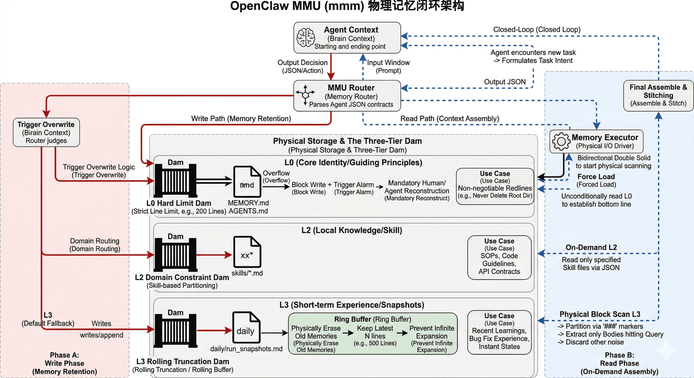
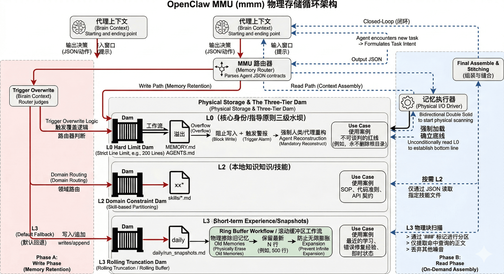

# OpenClaw `mmm` Memory Convergence System

[🇨🇳 切换至中文版 (Chinese Version)](#openclaw-mmm-记忆收敛系统-中文说明)

This repository implements a **Memory Management Unit (MMU)** for AI Agents. It replaces the naive "save everything" approach with a strict **Convergence Judge** that intercepts all memory Read/Write operations to prevent context window bloat, schizophrenic agent behavior, and "Scrapbook Anti-patterns".

---

## 1. Core Philosophy: The L0-L3 Four-Layer Memory Architecture

Most Agent memory systems fail because they mix Identity, Experience, and Knowledge. `mmm` enforces strict separation of concerns:

| Layer | What it is | When it acts | `mmm`'s Role | Storage Location |
|---|---|---|---|---|
| **L0 (Identity)** | Principles, preferences, absolute boundaries. | **Always On** (L1 Cache). Evaluated before any action. | `mmm` protects this layer. Only highly durable "behavior-shaping rules" get promoted here. | `AGENTS.md`, `MEMORY.md` |
| **L3 (Experience)** | Past conversations, run snapshots, "what we did yesterday". | **On Demand** (L3b). Pulled only when `mmm` explicitly asks for it via `read_decision`. | `mmm` writes snapshots here during Phase B, and recalls them during Phase A ONLY if needed. | `daily/`, `archive/` |
| **L2 (Local Knowledge)** | Docs, code snippets, factual references. | **On Demand**. Searched by dedicated tools (e.g., Sirchmunk) when evidence is needed. | `mmm` does NOT store knowledge. It points to `references/` or triggers knowledge retrieval tools. | `references/`, `skills/` |
| **L1 (Web)** | External facts. | **Last Resort**. | `mmm` avoids this unless L2/L3 fails. | External |

**A good memory system is quiet.** `mmm` ensures we don't dump L3 (Experiences) into L0 (Identity).

---

## 2. Architecture Data Flow (CQRS)

`mmm` acts as the single judge for both reading and writing, preventing "double truths."



### Phase A: The READ Path (Context Assembly)
*Triggered when a new user request arrives.*
1. User says: "Parse this PDF and output a summary."
2. OpenClaw routes the intent to `mmm` (Phase A).
3. `mmm` outputs JSON indicating which **Skills** (e.g., `pdf-parser`) and **Memories** (e.g., `pdf_formatting_rules` from L3) to dynamically load.
4. OpenClaw injects ONLY these requested assets into the Context Window.

### Phase B: The WRITE Path (Memory Retention)
*Triggered when a task completes, fails, or user says "Save".*
1. Task finishes. Agent learns a new API constraint.
2. Agent submits this candidate to `mmm` (Phase B).
3. `mmm` evaluates: Is it durable? Does it conflict with L0?
4. `mmm` outputs JSON (`write_decision`: write, overwrite, downgrade, or discard).
5. OpenClaw executes the file system writes exactly as dictated.

---

## 3. Directory Structure

### Agent Runtime Zone (The Core)
This entire repository is built as a standard Anthropic Skill package.
- `SKILL.md`: **The Prompt/Logic for the `mmm` Convergence Judge.** This is the entry point of the `mmm` skill.
- `schemas/memory-routing.schema.json`: The hard JSON contract that `mmm` MUST output during Read/Write decisions.
- `scripts/skill-creator-enhanced/SKILL.md`: A bundled downstream execution script/skill. Triggered ONLY when `mmm` decides a structural skill rewrite is needed (handoff).
- `scripts/core/memory_executor.py`: The physical execution layer that safely writes JSON decisions to disk.

### Human Reference & Testing Zone (Isolated from Agent Context)
- `references/`: Theoretical background, example config (`agent.yml`), and L0 identity examples (`AGENTS.md`, `MEMORY.md`).
- `tests/`: End-to-end and unit tests verifying the compliance of any Agent using this system. Run with `pytest tests/ -v`.
- `examples/`: Adoption examples.

---

## 4. Getting Started & Verification

If you are integrating `mmm` into OpenClaw, your implementation MUST pass the provided compliance test suite.

```bash
# Run the compliance tests
pytest tests/ -v
```

This verifies that the Agent respects the "Quiet System" rule, handles SSOT overwrites correctly, and successfully closes the "Write-then-Read" end-to-end loop.

---
---

# OpenClaw `mmm` 记忆收敛系统 (中文说明)

[🇬🇧 Switch to English Version (英文版)](#openclaw-mmm-memory-convergence-system)

本项目为 AI Agent 实现了一个**内存管理单元 (MMU)**。它摒弃了粗暴的“保存所有对话”的做法，通过一个严格的**收敛裁判 (Convergence Judge)** 拦截所有的记忆读写操作，防止上下文窗口膨胀、Agent 行为精神分裂以及“剪贴簿反模式”。

---

## 1. 核心哲学：L0-L3 四层记忆架构

绝大多数 Agent 记忆系统失败的原因在于它们混淆了“身份(Identity)”、“经历(Experience)”和“知识(Knowledge)”。`mmm` 强制执行严格的职责分离：

| 层级 | 是什么 | 触发时机 | `mmm` 的职责 | 存储位置 |
|---|---|---|---|---|
| **L0 (身份)** | 原则、偏好、绝对边界。 | **常驻** (L1 Cache)。任何动作前都会被评估。 | `mmm` 负责保护这一层。只有极高复用价值的“行为塑造规则”才允许升格至此。 | `AGENTS.md`, `MEMORY.md` |
| **L3 (经历)** | 历史对话、运行快照、“昨天我们做了什么”。 | **按需加载** (L3b)。只有当 `mmm` 明确要求读取时才出场。 | `mmm` 在写入阶段将快照降级到此处，并在读取阶段仅拉取相关的快照。 | `daily/`, `archive/` |
| **L2 (本地知识)** | 文档、代码片段、事实参考。 | **按需加载**。当需要证据时由专属工具（如 Sirchmunk）搜索。 | `mmm` **不存储**知识。它只负责输出指令让其他工具去检索。 | `references/`, `skills/` |
| **L1 (外网)** | 外部事实。 | **最后手段**。 | 除非 L2/L3 找不到，否则 `mmm` 尽量避免使用。 | External |

**一个好的记忆系统是安静的。** `mmm` 确保我们绝不会把 L3 的冗长经历当成 L0 的身份塞进核心区。

---

## 2. 架构与数据流 (CQRS)

`mmm` 作为读写操作的单一法官，彻底杜绝了“双重事实（Double Truths）”的出现。



### 阶段 A：读链路 (上下文组装 Context Assembly)
*触发条件：新的用户请求到达时。*
1. 用户说：“解析这份 PDF 并输出摘要。”
2. OpenClaw 将意图路由给 `mmm` (阶段 A)。
3. `mmm` 输出 JSON，指示应该动态加载哪些 **技能(Skills)** (如 `pdf-parser`) 和哪些 **历史记忆(Memories)** (如从 L3 拉取防坑快照)。
4. OpenClaw 将这些被选中的资产连同 L0 文件一起注入到当前上下文窗口。

### 阶段 B：写链路 (记忆收敛 Memory Retention)
*触发条件：任务完成、报错，或用户显式发送“保存”指令。*
1. 任务结束，Agent 学到了一个新的 API 限制。
2. Agent 将候选经验提交给 `mmm` (阶段 B)。
3. `mmm` 评估：这经验持久吗？它是否和 L0 原有的规则冲突？
4. `mmm` 输出 JSON 决策 (`write_decision`: 写入、覆盖、降级或丢弃)。
5. OpenClaw 的执行器严格按照决策写入物理文件系统。

---

## 3. 目录结构

### 核心运行时区 (Agent Runtime Zone)
整个仓库本身就是一个标准的 Anthropic Skill 包。
- `SKILL.md`: **`mmm` 收敛裁判的提示词与逻辑。** 这是 Agent 唯一需要读取的大脑文件。
- `schemas/memory-routing.schema.json`: 强 JSON 契约。规定了 `mmm` 在读写时必须输出的数据格式。
- `scripts/skill-creator-enhanced/SKILL.md`: 绑定的下游重构专家。仅在 `mmm` 裁决需要修改底层代码结构（handoff）时被唤醒。
- `scripts/core/memory_executor.py`: 物理执行层，负责安全地将 JSON 决策落盘。

### 人类阅读与测试区 (与 Agent 隔离)
- `references/`: 理论背景、配置范本 (`agent.yml`) 以及 L0 身份范本 (`AGENTS.md`, `MEMORY.md`)。
- `tests/`: 端到端测试套件，用于验证接入此系统的 Agent 是否合规。
- `examples/`: 代码接入示例。

---

## 4. 接入与验证

如果你正准备将 `mmm` 接入 OpenClaw，你的代码实现必须通过以下合规性测试：

```bash
# 运行强制准入测试
pytest tests/ -v
```

该测试将验证 Agent 是否遵守了“安静系统”原则，是否能正确处理 SSOT 覆盖，以及能否成功闭环“写后即用”的端到端生命周期。